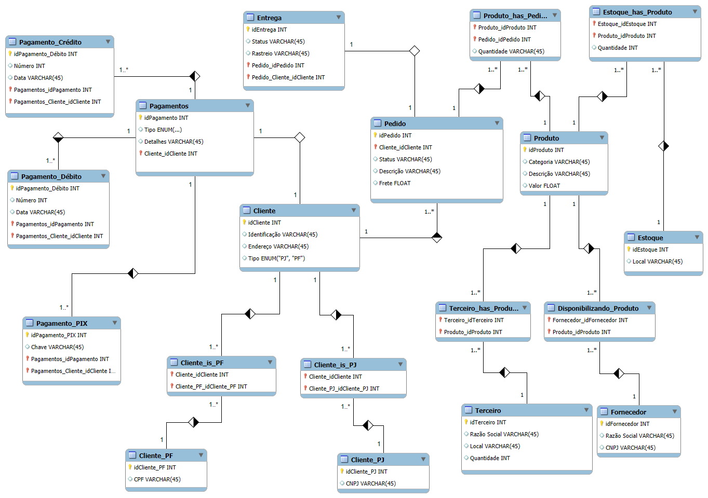

# Refinando um Projeto Conceitual de Banco de Dados – E-COMMERCE

Projeto com objetivo de explorar o processo de modelagem de banco de dados para um sistema de e-commerce, passando pelas etapas de levantamento de requisitos, modelagem conceitual e construção do modelo lógico.

- Contexto: Levantamento de Requisitos;
- Conceitual: Modelo ER;
- Lógico: Relacional;

## Exemplo Ordem de Serviço

### Contexto OS

- Dentro de uma empresa os clientes demandam ao helpdesk algumas ações. Essas ações são convertidas em ordens de serviços.

1. Cliente realiza pedido;
2. O pedido é convertido em ordem de serviço caso possa ser reallizado;
3. O técnico executa a ordem de serviço. Após sua finalização, a mesma é arquivada.

### Entidades

- Cliente;
- Responsável;
- Pedido e Ordem de Serviço;

### Relacionamentos

- Solicita (Cliente solicita pedido);
- Analisa (Responsável analisa pedido);
  - Geração da ordem de serviço;
- Executa (Vira Ordem de Serviço);
- Arquiva;

## Contexto E-Commerce

### Narrativa: Produto

- Os produtos são vendidos por uma única plataforma online;
  - Podem ter vendedores distintos (terceiros).
- Cada produto possui um fornecedor;
- Um ou mais produtos podem (devem) compor um pedido;

### Narrativa: Cliente

- O Cliente pode se cadastrar no site com seu CPF ou CNPJ;
- O  Endereço do cliente irá determinar o valor do frete;
- Um cliente pode  comprar mais de um pedido;
  - Este tem um período de carência para devolução do produto.

### Narrativa: Pedido

- Pedidos são criados por clientes e possuem informações de compra, endereço e status da entrega;
- Um produto  ou mais compoem o pedido;
- O  pedido pode ser cancelado;

### Refinamento

### 1. Cliente PJ e PF

- Uma conta pode ser **Pessoa Física (PF)** ou **Pessoa Jurídica (PJ)**, mas não pode conter informações de ambos os tipos.
- Implementação feita com tabelas separadas para clientes PF e PJ, garantindo que cada um tenha os atributos específicos e seja identificado de forma única no sistema.

### 2. Pagamento

- Um cliente pode cadastrar **múltiplas formas de pagamento** (Crédito, Débito, PIX, etc.).
  
### 3. Entrega

- O status e o código de rastreio são armazenados, permitindo que o cliente acompanhe o progresso da entrega do seu pedido.

